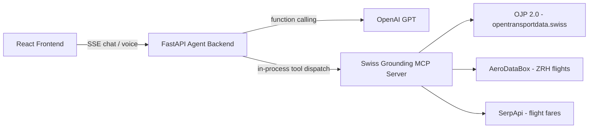

# 🇨🇭 Swiss Transport Assistant

An AI travel assistant that plans real Swiss journeys — trains, transfers, and Zurich Airport flights — grounded in live official data, with an interactive map and voice input.

Built during the Swiss AI Weeks hackathon (Zurich, 2026) on top of **OJP 2.0** (Switzerland's open transport data platform), with an LLM agent that calls typed, auditable tools instead of guessing.

## ✨ Highlights

- **Multimodal journey planning** — train connections with transfers, intermediate "via" stops, and flight-to-train handoffs at Zurich Airport (ZRH), all resolved against the live timetable.
- **Interactive dynamic map** — Mapbox GL JS renders every leg of the journey with corridor-aware geocoding, so intermediate stops land in the right place even for stations the API doesn't geocode directly.
- **Official SBB booking links** — every result links straight to SBB's own timetable/booking page, with the departure date computed in Swiss local time (not naively sliced from a UTC timestamp).
- **LLM agent with function calling (MCP)** — the assistant exposes its data sources as typed [Model Context Protocol](https://modelcontextprotocol.io/) tools; the LLM decides which to call, and every answer carries a source citation instead of being invented.
- **Voice input/output** — ask by speaking (OpenAI Whisper transcription) and get a spoken reply back (OpenAI TTS).

## 🏗️ Architecture & Tech Stack



**Frontend** — React 19, TypeScript, Tailwind CSS, Mapbox GL JS, Vite, Vitest.

**Backend** — FastAPI (streaming chat over Server-Sent Events), Python, [Model Context Protocol](https://modelcontextprotocol.io/) tool server, OJP 2.0 (Swiss Open Transport Data), OpenAI (GPT for the agent, Whisper for speech-to-text, TTS for speech-out).

The project is split into three independent packages under [`swiss-grounding-mcp/`](swiss-grounding-mcp/):

| Package | Role |
| --- | --- |
| [`server/`](swiss-grounding-mcp/server/) | The MCP server: typed tools for train connections, station boards, disruptions, fares, and ZRH flights, each backed by a real data source and returning a structured status (never a silent guess). |
| [`agent-backend/`](swiss-grounding-mcp/agent-backend/) | FastAPI app wrapping an OpenAI-driven agent loop that dispatches to the MCP tools and streams the conversation to the frontend. |
| [`frontend/`](swiss-grounding-mcp/frontend/) | The chat UI: journey cards, station boards, the interactive route map, and voice controls. |

See [`swiss-grounding-mcp/README.md`](swiss-grounding-mcp/README.md) for the full technical reference (MCP tool schemas, declared scope, credentials, and evaluation notes).

## 🚀 Quick Start

**1. Clone the repository**

```bash
git clone https://github.com/SergiVillagrasa/SwissAI-Hacks26.git
cd SwissAI-Hacks26
```

**2. Configure environment variables**

Copy each package's `.env.example` to `.env` and fill in your own API keys (OpenAI, Mapbox, OJP, ...):

```bash
cp swiss-grounding-mcp/server/.env.example swiss-grounding-mcp/server/.env
cp swiss-grounding-mcp/agent-backend/.env.example swiss-grounding-mcp/agent-backend/.env
cp swiss-grounding-mcp/frontend/.env.example swiss-grounding-mcp/frontend/.env.local
```

**3. Install dependencies and start the app**

```bash
# Backend (FastAPI agent, http://127.0.0.1:3001)
cd swiss-grounding-mcp/agent-backend && uv sync
npm run dev:api   # from the repo root, in a separate terminal

# Frontend (Vite, http://localhost:3000)
cd swiss-grounding-mcp/frontend && npm install
npm run dev:web   # from the repo root, in a separate terminal
```

(`npm run dev:api` / `npm run dev:web` are defined in the root [`package.json`](package.json); a [`Makefile`](Makefile) with equivalent `make dev-api` / `make dev-web` targets is also available.)

## ✅ Running the tests

```bash
# Python backends (from the repo root)
npm run test:server   # MCP server: pytest
npm run test:api       # Agent backend: pytest

# Frontend (from swiss-grounding-mcp/frontend)
npm run test           # vitest
npx tsc --noEmit       # TypeScript type-check
```

Or run everything in one go: `npm run test:all` from the repo root.

## 📄 License

[MIT](LICENSE)
