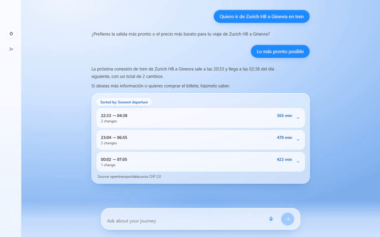
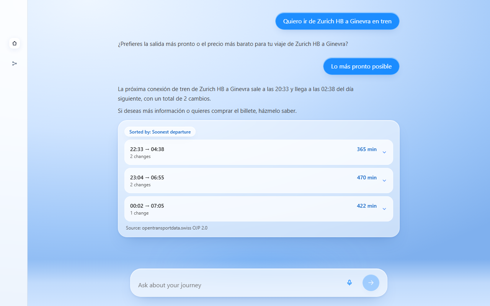
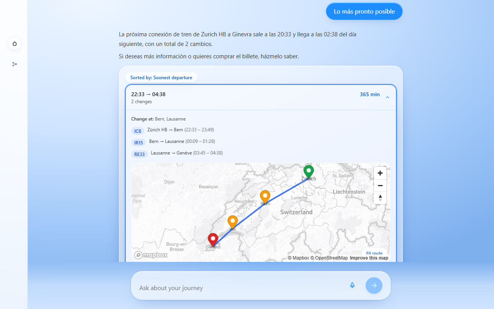
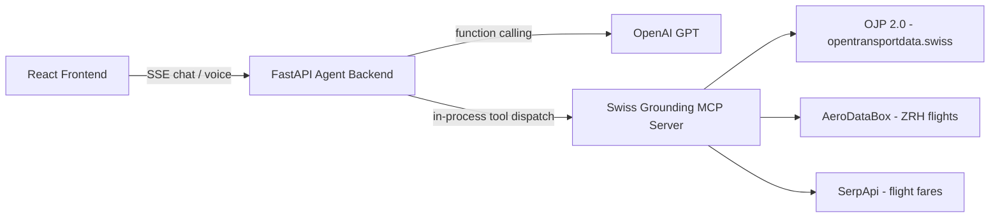

# Swiss Transport Assistant

An AI travel assistant that plans real Swiss journeys — trains, transfers, and Zurich Airport flights — grounded in live official data, with an interactive map and voice input.

Built during the Swiss AI Weeks hackathon (Zurich, 2026) on top of **OJP 2.0** (Switzerland's open transport data platform), with an LLM agent that calls typed, auditable tools instead of guessing.

## Demo

Asking for a real journey (Zürich HB → Genève) streams a sorted list of live connections, then expands into an interactive, markered route map:



| Landing screen | Connection results | Interactive route map |
| --- | --- | --- |
|  |  |  |

## Highlights

- **Multimodal journey planning** — train connections with transfers, intermediate "via" stops, and flight-to-train handoffs at Zurich Airport (ZRH), all resolved against the live timetable.
- **Interactive dynamic map** — Mapbox GL JS renders every leg of the journey with corridor-aware geocoding, so intermediate stops land in the right place even for stations the API doesn't geocode directly.
- **Official SBB rail links** — public-transport fare and flight-to-train results link straight to SBB's own timetable/booking page, with the departure date computed in Swiss local time (not naively sliced from a UTC timestamp).
- **LLM agent with function calling (MCP)** — the assistant exposes its data sources as typed [Model Context Protocol](https://modelcontextprotocol.io/) tools; the LLM decides which to call, and every answer carries a source citation instead of being invented.
- **Voice input/output** — ask by speaking (OpenAI Whisper transcription) and get a spoken reply back (OpenAI TTS).

## Architecture & Tech Stack



**Frontend** — React 19, TypeScript, Tailwind CSS, Mapbox GL JS, Vite, Vitest.

**Backend** — FastAPI (streaming chat over Server-Sent Events), Python, [Model Context Protocol](https://modelcontextprotocol.io/) tool server, OJP 2.0 (Swiss Open Transport Data), OpenAI (GPT for the agent, Whisper for speech-to-text, TTS for speech-out).

The project is split into three independent packages under [`swiss-grounding-mcp/`](swiss-grounding-mcp/):

| Package | Role |
| --- | --- |
| [`server/`](swiss-grounding-mcp/server/) | The MCP server: typed tools for train connections, station boards, disruptions, fares, and ZRH flights, each backed by a real data source and returning a structured status (never a silent guess). |
| [`agent-backend/`](swiss-grounding-mcp/agent-backend/) | FastAPI app wrapping an OpenAI-driven agent loop that dispatches to the MCP tools and streams the conversation to the frontend. |
| [`frontend/`](swiss-grounding-mcp/frontend/) | The chat UI: journey cards, station boards, the interactive route map, and voice controls. |

See [`swiss-grounding-mcp/README.md`](swiss-grounding-mcp/README.md) for the full technical reference (MCP tool schemas, declared scope, credentials, and evaluation notes).

## Quick Start

### Prerequisites

- [**uv**](https://docs.astral.sh/uv/getting-started/installation/) — manages the Python backend. It downloads a compatible Python (3.10+) automatically if you don't have one.
- [**Node.js**](https://nodejs.org/) **20.19+ or 22.12+** (with npm) — runs the frontend.

### 1. Clone

```bash
git clone https://github.com/SergiVillagrasa/SwissAI-Hacks26.git
cd SwissAI-Hacks26
```

### 2. Add your API keys

```bash
cp swiss-grounding-mcp/server/.env.example swiss-grounding-mcp/server/.env
cp swiss-grounding-mcp/agent-backend/.env.example swiss-grounding-mcp/agent-backend/.env
cp swiss-grounding-mcp/frontend/.env.example swiss-grounding-mcp/frontend/.env.local
```

Then fill in these values:

- `OPENAI_API_KEY` in `agent-backend/.env` — **Required** — chat agent and voice
- `OJP_API_TOKEN` in `server/.env` — **Required** — live Swiss timetable data ([opentransportdata.swiss](https://opentransportdata.swiss/))
- `VITE_MAPBOX_TOKEN` in `frontend/.env.local` — **Required** — interactive route map
- `AERODATABOX_API_KEY` in `server/.env` — Optional — Zurich Airport flights
- `SERPAPI_API_KEY` in `server/.env` — Optional — flight fares

`server/.env` is also read by the backend, so the data-source keys only need to be set once.

### 3. Install and run

```bash
npm install --prefix swiss-grounding-mcp/frontend
```

Then start each part in its own terminal from the repo root:

```bash
npm run dev:api   # backend  → http://127.0.0.1:3001  (uv installs Python deps on first run)
npm run dev:web   # frontend → http://localhost:3000
```

Open **http://localhost:3000** and ask for a journey, e.g. *"Zürich HB to Genève tomorrow at 9"*.

## Running the tests

```bash
# MCP server (233 tests)
(cd swiss-grounding-mcp/server && uv run pytest)

# Agent backend (67 tests)
(cd swiss-grounding-mcp/agent-backend && uv run pytest)

# Frontend (133 tests + type-check)
(cd swiss-grounding-mcp/frontend && npm test && npx tsc --noEmit)
```

Or run everything in one go from the repo root: `npm run test:all` — it chains `test:server`, `test:api`, and `test:web` (the latter runs `vitest` **and** `tsc --noEmit`, matching the commands above exactly).

## License

[MIT](LICENSE)
