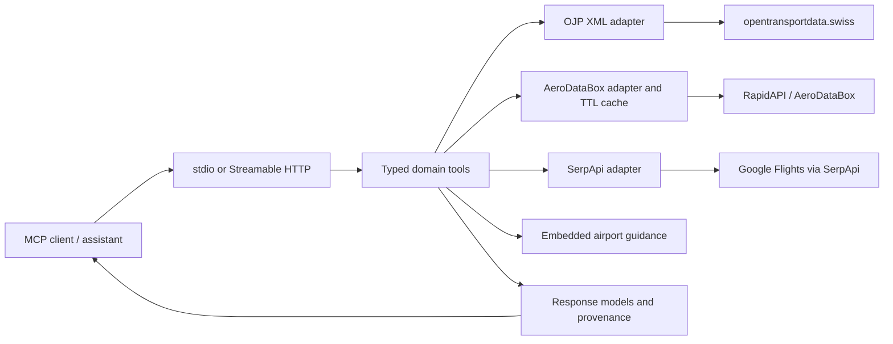

# Swiss Grounding MCP Server

Swiss Grounding MCP Server gives MCP-compatible assistants structured evidence for Swiss public transport, Zurich Airport flights, passenger guidance, and selected domestic flight fares. It combines live OJP timetable data with clearly identified commercial aviation providers and curated official airport guidance, returning citations and explicit failure states instead of generating answers with an internal LLM.

Built for the Swisscom myAI challenge at the Swiss AI Weeks Zurich Hackathon, 24–25 September 2026. The [official briefing deck](briefing-swiss-grounding-mcp.pdf) describes the evaluation priorities; this README declares the implemented scope and its boundaries.

## Evaluation quick start

### 1. Commit to evaluate

Documentation branch: **`sergi/add-readme`**. Application baseline verified for this handoff: **`a04c2e5f71cd382a652392b63e29e69a9fd4f34a`**. This documentation change does not establish an official submission tag or imply that the branch has been merged into `main`.

### 2. Transport

**stdio** is the default transport; the MCP client launches the process and owns its standard input/output. **Streamable HTTP** defaults to host **`127.0.0.1`**, port **`8000`**, and endpoint **`/mcp`**, giving `http://127.0.0.1:8000/mcp`. HTTP clients must perform the MCP initialization handshake and retain the session identifier returned by the server.

### 3. Runtime

[Project metadata](server/pyproject.toml) declares **Python 3.10+** and uses **`uv`**. This handoff was checked on **Linux x86_64, Python 3.14.5, uv 0.12.18**. The [Dockerfile](server/Dockerfile) targets **Python 3.12** on Linux; Python 3.12 and Apple Silicon execution were not independently tested in this run. Neither source code nor Dockerfile pins an x86-only platform, but that is not a verified ARM compatibility result.

Install Python and `uv` before setup. Internet access is needed for dependency installation and live provider calls. The MCP server needs no database, GPU, Node.js, microphone, or LLM credentials. Default dependency groups also install evaluation and voice libraries; using microphone features separately may require system audio libraries and devices.

### 4. Setup

From the repository root, with Python and `uv` installed:

```bash
cd swiss-grounding-mcp/server && uv sync
```

This is unattended and starts no external services. Credentials are only needed for the associated live tools; the static guidance tool works without them. Configure process environment variables or a local `server/.env` using the names below; startup calls `load_dotenv()`.

Measured on an already provisioned environment: **0.03 s** for `uv sync`, **30,004 KiB** peak setup RSS, and **179 MiB** for the existing `.venv` (`du -sh`). These are warm-environment measurements, not a clean-install benchmark. Cold download time and disk use including the package cache are unmeasured. For evaluation planning, allow several minutes, 1 GiB free RAM, and 1 GiB free disk as estimates, not tested minimum requirements.

### 5. Start command

Run either command from `swiss-grounding-mcp/server`:

```bash
uv run swiss-grounding-mcp --transport stdio
```

```bash
uv run swiss-grounding-mcp --transport streamable-http --host 127.0.0.1 --port 8000
```

`MCP_HTTP_HOST` and `MCP_HTTP_PORT` supply defaults when the corresponding CLI flags are omitted. For an existing MCP client configuration, use command `uv`, arguments `run`, `swiss-grounding-mcp`, `--transport`, `stdio`, and this server directory as its working directory.

### 6. Prebuilt data

Five curated airport guidance records ship in [sources/zrh/guidance.py](server/src/swiss_grounding_mcp/sources/zrh/guidance.py): `arrival_process`, `transfers`, `baggage`, `airport_rail_access`, and `flight_status_verification`. They include official airport URLs and limitations. There is no vector index, embedding download, crawler, or generated dataset to build.

**Refresh command: none implemented.** Guidance refresh requires reviewing the cited pages and manually updating the records. All dynamic transport and fare data is queried on demand; AeroDataBox responses may be reused for 60 seconds by default. Restarting the process clears that in-memory cache.

### 7. Credentials

These are the complete credentials read by the MCP server. No LLM key is required.

| Variable | Purpose | Behavior when missing |
| --- | --- | --- |
| `OJP_API_TOKEN` | Bearer token for OJP 2.0 and the OJP Fare endpoint | No startup failure or explicit missing-key guard; requests use an empty bearer token, and upstream authentication failures become `source_error`. A fare-endpoint failure after successful station resolution returns `fallback_link`. |
| `AERODATABOX_API_KEY` | RapidAPI key for AeroDataBox flight lookups and searches | `source_unavailable`; static guidance remains available. A flight-to-train lookup can request a caller-confirmed arrival time instead. |
| `SERPAPI_API_KEY` | SerpApi Google Flights searches | `get_flight_fares` returns `source_error`; other providers are unaffected. |

Use credentials with access to the required provider products, and supply evaluator access through the organisers' secure channel. Do not put keys in the README, MCP arguments, or tracked files. Optional voice, evaluation, and agent applications have separate credentials and are not needed for this MCP handoff.

All other server environment settings are listed here; defaults come from [Settings](server/src/swiss_grounding_mcp/config/settings.py).

| Variable | Default | Purpose |
| --- | --- | --- |
| `OJP_BASE_URL` | `https://api.opentransportdata.swiss/ojp20` | Location, trip, and stop-event API |
| `OJP_FARE_URL` | `https://api.opentransportdata.swiss/ojpfare/` | Fare Beta API |
| `OJP_REQUESTOR_REF` | `swiss-grounding-mcp` | OJP requestor identifier |
| `OJP_TIMEOUT_SECONDS` | `10` | OJP HTTP timeout |
| `TRIP_TIME_MARGIN_MINUTES` | `10` | One nearby-time retry when an explicit-time trip search is empty |
| `AERODATABOX_ENABLE` | `true` | Disable aviation provider access with `false` |
| `AERODATABOX_HOST` | `aerodatabox.p.rapidapi.com` | RapidAPI host header |
| `AERODATABOX_BASE_URL` | `https://aerodatabox.p.rapidapi.com` | Aviation API base URL |
| `AERODATABOX_TIMEOUT_SECONDS` | `10` | Aviation HTTP timeout |
| `AERODATABOX_CACHE_SECONDS` | `60` | In-process response cache lifetime |
| `SERPAPI_BASE_URL` | `https://serpapi.com/search.json` | Flight-search endpoint |
| `SERPAPI_TIMEOUT_SECONDS` | `10` | Flight-search HTTP timeout |
| `MCP_HTTP_HOST` | `127.0.0.1` | HTTP bind address |
| `MCP_HTTP_PORT` | `8000` | HTTP bind port |
| `RESPECT_ROBOTS_TXT` | `true` | Reserved policy flag; current adapters do not consult it |

### 8. Hosted endpoint

**N/A (Local execution)** for this handoff. No public endpoint or hosted authentication credentials were verified. The local MCP application configures no authentication headers of its own. Keep the loopback binding for local evaluation; any public deployment needs independently configured access controls.

### 9. Declared scope

| Area | Geography and topics | Reference period |
| --- | --- | --- |
| Public transport | All of Switzerland through OJP coverage: passenger connections, rail and regional transit legs, Swiss stop boards, and domestic fares. Connections may cross the border when at least one endpoint is Swiss. | Provider's current timetable and available real-time updates; no historical archive service |
| Disruptions | Current cancellations, delays, and boarding/alighting restrictions inferred from OJP stop events; includes foreign stops indexed by OJP | Current stop-event response, not a comprehensive incident archive |
| Aviation operations | ZRH / LSZH arrivals and departures, including international counterpart airports; lookup by flight number or filtered airport search | Provider-supported requested dates, including scheduled future flights; historical coverage is not guaranteed |
| Airport guidance | Zurich Airport passenger guidance, with official Flughafen Zürich AG citations | Embedded static text, not a live page fetch |
| Commercial flight fares | ZRH, GVA, BSL/EAP/MLH, LUG, ACH, and SIR endpoint aliases; Basel/Mulhouse is included in this Swiss travel scope despite its cross-border geography | Search results for the requested date; no price or availability guarantee |

**Languages (DE, FR, IT, EN):** clients may formulate questions in these languages and pass source-recognized station names, but the MCP server has no language parameter or translation layer. Tool descriptions, status messages, and embedded guidance are English; multilingual interpretation and presentation belong to the calling assistant. This run does not establish end-to-end support for all four languages. **Romansh**, included in the challenge's national-language evaluation, is likewise not independently verified.

### 10. Example call

After MCP initialization, send this complete JSON-RPC tool request through the established connection. It requires no provider credentials:

```json
{
  "jsonrpc": "2.0",
  "id": 2,
  "method": "tools/call",
  "params": {
    "name": "get_airport_guidance",
    "arguments": {"topic": "flight_status_verification"}
  }
}
```

The MCP result exposes the domain payload in `result.structuredContent`. The following payload was produced directly by the tool during this documentation check; its timestamp will change on subsequent calls:

```json
{
  "status": "answered",
  "topic": "flight_status_verification",
  "message": null,
  "guidance": "To verify the latest scheduled, estimated, or actual time for a specific flight, use this server's flight-lookup tool, or check the official Zurich Airport arrivals/departures pages directly.",
  "source": "Flughafen Zürich AG",
  "source_url": "https://www.flughafen-zuerich.ch/en/passengers/fly/flightinformation/arrivals",
  "retrieved_at": "2026-09-25T09:40:18Z",
  "applicable_airport": "ZRH / LSZH",
  "limitations": "This server's own flight-lookup tool is sourced from AeroDataBox (aerodatabox.com), a third-party aggregator, not from Zurich Airport's operational systems; always treat times as estimates until confirmed by the airline or airport display."
}
```

### 11. Known limits

No general Swiss legal, tax, health insurance, municipal waste, school holiday, visa, or immigration service is implemented. Purely foreign connection searches, foreign station boards, and international public-transport fare pricing are outside scope; cross-border connection searches and wider-network disruption lookups are explicit exceptions. Aviation operations are limited to ZRH, while flight-fare endpoints use the six listed airport groups.

Historical archive queries, guaranteed fares, guaranteed gates, guaranteed transfer feasibility, and complete incident coverage are not provided. Commercial provider quotas and subscription permissions apply; a free API tier is not a price or availability guarantee. Some dates and malformed inputs may surface MCP errors rather than a domain status. No claim is made that every provider field or caller-generated answer is correct.

### 12. robots.txt and terms of use

**`RESPECT_ROBOTS_TXT=true`** is parsed and configurable (for example, set `RESPECT_ROBOTS_TXT=false`), but **no current adapter uses the value**. The server calls keyed OJP, AeroDataBox, and SerpApi APIs and reads embedded guidance; it does not crawl airport HTML or fetch robots.txt. This is a documented implementation boundary, not active robots.txt enforcement.

Provider access uses the configured account credentials and preserves source attribution in returned data. The application does not enforce subscription terms, licensing, or quotas. Operators must ensure that their accounts permit evaluation and any subsequent use; this README does not assert current plan prices or limits. The configurable policy requirement therefore has a setting, but no implemented behavioral switch for current sources.

### 13. Parallel use

Streamable HTTP can serve multiple MCP clients. The installed MCP SDK executes synchronous tools in worker threads. Domain calls carry their own arguments and no conversation history, but **HTTP transport is sessionful** (`stateless_http=False` by default); this application does not override that default. Do not treat requests as anonymous stateless HTTP calls.

Clients share lazily created provider clients and the AeroDataBox cache within one process. `find_connections` resolves its two stations using a shared two-worker thread pool. stdio clients normally launch separate processes. There is no distributed cache, cache-miss coalescing, global rate limiter, or measured multi-client capacity guarantee.

A fresh Python process importing the server and returning one static guidance result took **1.48 s**, with **79,588 KiB** peak RSS, on the verification machine. This measures local import plus a direct static-tool call, not an HTTP cold start or live-provider latency. Live first-call latency and sustained concurrent throughput remain unmeasured; each upstream request has a default 10-second timeout, and one tool call may make several requests.

## System architecture and component design



[server.py](server/src/swiss_grounding_mcp/server.py) registers nine MCP tools and the transport CLI. [tools/](server/src/swiss_grounding_mcp/tools/) implements validation, scope decisions, station resolution, and orchestration. [sources/](server/src/swiss_grounding_mcp/sources/) owns HTTP access and parsing; [domain/models.py](server/src/swiss_grounding_mcp/domain/models.py) defines the typed payloads; [evidence/](server/src/swiss_grounding_mcp/evidence/) builds source metadata.

Public transport requests go to the Swiss public-transport open-data platform's OJP service, identified in the project briefing as a source operating under a Federal Office of Transport mandate. Location-information requests resolve names before trip, stop-event, or fare requests. Swiss scope checks use `ch:` stop references or Swiss `85xxxxx` UIC identifiers. No generic web search selects an alternative rail source.

Aviation operations use **AeroDataBox, a third-party aggregator**, not the airport operator or a Swiss authority. Airport guidance separately cites **Flughafen Zürich AG**. Commercial fare searches use **SerpApi Google Flights**, also a third-party source. `connect_flight_to_train` combines an arrival time and an explicitly supplied transfer buffer with an OJP search from Zürich Flughafen, returning separate flight and rail provenance.

The adjacent [agent backend](agent-backend/) and [frontend](frontend/) are optional consumers. Neither is required for standard MCP evaluation.

## MCP tools and schema reference

The canonical contract is the registered functions and generated MCP `tools/list` schemas. The response vocabulary is **not uniform across all tools**:

| Family | Actual status values |
| --- | --- |
| Transport / flight fares (`T`) | `ok`, `needs_clarification`, `not_found`, `out_of_scope`, `source_error` |
| Public-transport fares (`F`) | `success`, `fallback_link`, `out_of_scope`, `needs_clarification`, `source_error` |
| Aviation / guidance (`A`) | `answered`, `needs_context`, `insufficient_evidence`, `out_of_scope`, `source_unavailable` |

For client presentation, `answered` and `success` mean successful evidence retrieval, `needs_context` requests clarification, `insufficient_evidence` reports no supported answer, and `source_unavailable` reports a provider failure. `fallback_link` is a booking referral **without a verified price**. These interpretations do not rename the wire statuses. Each family describes permitted model values; an individual tool may emit only a subset.

Arguments are strings unless marked integer. Optional arguments default to `null` unless a default is shown.

| Tool | Description and intended LLM trigger | Required arguments | Optional arguments | Status family |
| --- | --- | --- | --- | --- |
| `find_connections` | “How do I travel from Bern to Zürich?” Swiss or Swiss-connected timetable search | `origin`, `destination` | `departure_time`, `arrival_time` (ISO 8601); `results=3` (integer, clamped 1–5) | T |
| `find_disruptions` | “Are services disrupted at this stop?” Current OJP stop-event impacts | `stop` | None | T |
| `get_station_board` | “What departs from this Swiss station next?” | `station` | `mode="departures"` (`departures`/`arrivals`); `when` (ISO 8601); `results=5` (integer, clamped 1–10) | T |
| `check_public_transport_fares` | “What does this domestic journey cost?” OJP fares or SBB referral | `origin`, `destination` | `departure_time` (ISO 8601); `travel_class="2"`; `discount_card` (e.g. `Halbtax`) | F |
| `get_flight_fares` | “Are there commercial flights between these supported airports, and at what price?” | `origin_city`, `destination_city` | `outbound_date` (`YYYY-MM-DD`, defaults to tomorrow on the server); `currency="CHF"` | T |
| `find_flight_by_number` | “What is the status of this ZRH flight on this date?” | `flight_number`, `flight_date` (`YYYY-MM-DD`) | `direction` (`arrival`/`departure` at ZRH) | A |
| `search_airport_flights` | “Show ZRH flights matching this airport or airline.” | `direction` (`arrival`/`departure`), `flight_date` (`YYYY-MM-DD`) | `airport_iata`, `airport_icao`, `airline_iata`; at least one filter is needed for an answer; `limit=10` (integer, clamped 1–100) | A |
| `get_airport_guidance` | “How do baggage, transfers, or rail access work at ZRH?” | `topic` (one of the five records in item 6) | None | A |
| `connect_flight_to_train` | “Which train can I take after landing at ZRH?” | `destination_station`, `transfer_buffer_minutes` (integer, minimum 15) | `flight_number` plus `flight_date`, or `confirmed_arrival_time` (ISO 8601); `rail_results=3` (integer, clamped 1–5 by rail search) | A |

Leave rail times unset for “now.” If both connection times are provided, departure takes precedence. An empty explicit-time search can retry once with the configured margin and reports that adjustment in its message; returned times still need checking against the passenger's constraints. Calling assistants must resolve other relative dates against the actual current date. Flight-fare results are capped at five itineraries.

Some registered descriptions still describe connections as Swiss-only; implementation and unit tests permit Swiss-connected cross-border routes. This README follows the executable behavior without modifying the tool descriptions.

## Grounding quality, freshness, and provenance model

Successful transport responses carry `source`, `source_url`, `retrieved_at`, and `timezone`, with an optional `booking_url`. Aviation adds `applicable_date`; guidance exposes publisher, official page URL, airport, and limitations directly. Flight lookup also reports `fields_present` and `fields_missing`. The combined flight-to-train response retains separate provenance blocks rather than implying a single source supports both legs.

**`retrieved_at` is generated when the domain response is built.** It is not the source's publication or update timestamp. For cached aviation data it can be newer than the actual HTTP retrieval by the cache lifetime; for static guidance it is the tool-call time, not a page-fetch or editorial-review date. No publisher-update timestamp, evidence snapshot, content hash, or provider request ID is exposed. JSON-RPC request IDs correlate calls but do not constitute source evidence identifiers. Some failures have no provenance block.

OJP citations usually identify the API endpoint; aviation and flight-fare citations identify provider homepages rather than replayable record URLs. Fare provenance points to the SBB booking link. These references identify origin and verification routes, but do not provide a full reproducible audit archive.

OJP times are passed through from the provider, and AeroDataBox parsing selects its UTC fields. **SerpApi fare departure/arrival strings are passed through without timezone conversion**, despite the shared provenance model's `UTC` default; clients must not assume those fare strings are UTC. Supply explicit UTC rail timestamps to avoid ambiguity.

The server makes no generative LLM calls. Typed extraction, missing-field reporting, clarification, scope rejection, and price-free fallback links reduce unsupported claims. They cannot guarantee that upstream data, curated text, or a downstream assistant is error-free. Clients should preserve citations, uncertainty, and distinctions between scheduled, estimated, and actual times.

## Operability, resilience, and security

AeroDataBox caches successful response bodies by request path and parameters for 60 seconds by default, using a monotonic clock. It also caches empty successful responses. The cache is process-local, has no explicit size bound, and is not shared across replicas. OJP and SerpApi have no application response cache. A full-day ZRH flight search uses two 12-hour API windows before filtering locally.

All three provider adapters default to a 10-second HTTP timeout. HTTP and parsing failures handled by the adapters produce source errors; AeroDataBox HTTP 204 is treated as an empty result. There is no general retry/backoff or rate-limiting implementation. The rail time-margin retry handles an empty timetable result, not a failed network request. OJP Fare failures after station resolution return an SBB link without inventing a price. Failed flight lookup in a connection workflow can ask for a confirmed arrival time.

MCP schemas validate typed arguments; domain code adds missing-context checks, scope checks, and result caps. OJP XML is built structurally and parsed with `defusedxml`. Validation is not comprehensive: for example, malformed airport-search dates can escape as exceptions. Provider exceptions may include response excerpts or request URLs; review diagnostic output before sharing it, especially for SerpApi, which passes its key as a query parameter.

This README contains no credentials and does not require committing `.env` files. That is not a repository-history secret audit. Tool instructions and returned source data are structurally separate, but the server does not implement a prompt-injection sanitizer or enforce how an assistant interprets returned text. Bind locally for evaluation; authentication, deployment hardening, distributed quotas, and robust multi-replica session routing are outside this implementation.

## Test suite and quality verification

From `swiss-grounding-mcp/server`:

```bash
uv run pytest tests -v
```

**Final verification on 25 September 2026: `172 passed, 6 skipped in 2.88s`** (178 collected), using `uv run pytest tests` on Linux x86_64 / Python 3.14.5. The run used `UV_CACHE_DIR=/tmp/swiss-readme-uv` because the default cache was read-only, and ran outside the sandbox after the sandboxed MCP registration tests stalled. The six skips are the opt-in live OJP cases. Tests cover provider parsing and failures, schema registration and calls, station resolution, scope handling, fares and fallback links, guidance, aviation, transfers, settings, provenance, and the optional voice assistant. Fixtures and stubs are not evidence of current provider availability.

Six live OJP compliance cases are gated by `SWISSCOM_LIVE_EVAL=1`. To run those separately with a valid token and network access:

```bash
SWISSCOM_LIVE_EVAL=1 uv run pytest tests/test_swisscom_compliance.py -v
```

Live credentials, live provider results, clean container builds, Apple Silicon, four-client/model combinations, multilingual answer quality, and hosted availability were not verified in this documentation pass.
